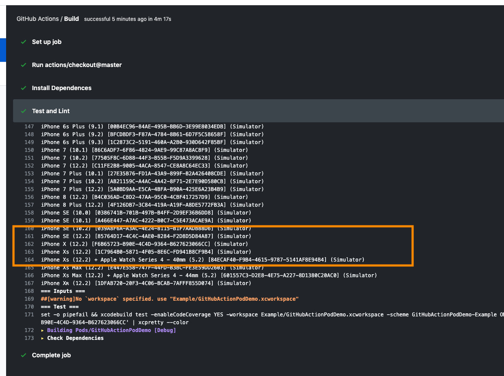

CocoaPods Action
===
[](https://github.com/ty0x2333/cocoapods-action/releases)

### Inputs

input | description | default |
:---: | :---------: | :-----: |
workspace | .xcworkspace file |
scheme    | Shared scheme |
use_modern_build_system | Use modern build system | false
additional_build_params | Additional xcodebuild params |
additional_lint_params | Additional `pod lib lint` params |
test | Run test | true
lint | Validate Pod | true

### Example

#### Simple

```yml
on: push
jobs:
  test:
    runs-on: macOS-latest
    steps:
    - uses: actions/checkout@master
    - name: Set XCode Version
      run: sudo xcode-select -s /Applications/Xcode_11.app
    - name: Install Dependences
      run: |
        cd Example
        pod repo update
        pod install
      shell: bash
    - uses: ty0x2333/cocoapods-action@master
      with:
        additional_build_params: -destination 'platform=iOS Simulator,name=iPhone 11,OS=13.0'
        additional_lint_params: --private
```

#### pod-template Project

If your project is created using `pod lib create`.

You can refer to this example: https://github.com/ty0x2333/GitHubActionPodDemo


### F&Q
#### IDETestOperationsObserverDebug: (XXXXXXXX-XXXX-XXXX-XXXX-XXXXXXXXXXXX) Finished requesting crash reports. Continuing with testing.

https://stackoverflow.com/questions/56326847/xcodebuild-skip-finished-requesting-crash-reports-continuing-with-testing

This is the BUG of `XCode 10.*`. It can be solved by specifying the ID of the simulator.

In the following example, we want to run on the iPhone X.

##### Step.1

Find the device you want in the output log of the running action.



```
=== Devices ===
Known Devices:
...
iPhone SE (12.2) [85764D17-4C4C-4AE0-8284-F2D8D5D84A87] (Simulator)
iPhone X (12.2) [F6B65723-B90E-4C4D-9364-B627623066CC] (Simulator)
iPhone Xs (12.2) [1C7964B0-5871-4F05-8E6C-FD941B8CF9B4] (Simulator)
...
```

**F6B65723-B90E-4C4D-9364-B627623066CC** is the ID of the iPhone X simulator

##### Step.2

Add `-destination` param to `additional_build_params`.

```yml
- uses: ty0x2333/cocoapods-action@master
  with:
    additional_build_params: -destination 'platform=iOS Simulator,id=F6B65723-B90E-4C4D-9364-B627623066CC'
```

#### For Private Pod

```yml
- uses: ty0x2333/cocoapods-action@master
  with:
    additional_lint_params: --private
```
